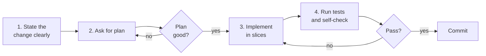

# Feature development (lightweight)

A faster, lighter version of `spec-driven-development.md` for features
that don't justify a full spec. The skeleton is still plan → confirm →
implement → verify, but compressed into a single working session.

## When to apply

- Features that touch 1-3 files.
- Changes scoped to a single domain (one component, one endpoint, one
  module).
- Work where you, not stakeholders, are the only one who needs to
  approve the design.

Use `spec-driven-development.md` instead when: the feature is large,
cross-cutting, or has stakeholders beyond the engineering team.

## Required tools

- An AI assistant with file edit access in your IDE.
- The repo's `.cursorrules` / `CLAUDE.md` properly configured (otherwise
  the assistant has no context).
- The repo's test command available (`npm test`, `pytest`, `go test`).

## The flow



## Step 1 — State the change clearly

Open your AI chat and write a single message containing:

- **What:** the change, in one sentence.
- **Why:** the reason (so the AI can make judgement calls when the
  request is ambiguous).
- **Where:** the file(s) you expect to change. If you are not sure, list
  the file you think is the entry point.
- **Constraints:** anything the AI must not do (e.g. "don't add a new
  dependency", "preserve the existing API").
- **Done when:** the observable behaviour that proves the change works.

Example:

> **What:** Add a "copy share link" button to the project detail page.
> **Why:** Users currently right-click the URL bar; analytics shows
> 60% of shares come from this manual path.
> **Where:** `src/pages/projects/[id]/index.tsx`, and probably a small
> utility in `src/lib/clipboard.ts`.
> **Constraints:** No new dependencies; use the existing Radix Button
> component. Must work in Safari (the default Clipboard API is fine).
> **Done when:** Clicking the button copies the project URL and shows
> a toast confirming the copy.

## Step 2 — Ask for a plan

> "Plan the implementation. Output: files to change, what changes per
> file, in dependency order. No code yet."

Critique the plan. Common issues:

- **Wrong file.** The AI guessed at structure and got it wrong. Point
  at the right file.
- **Scope expansion.** The AI proposes adjacent improvements. Say no.
- **Missing edge case.** Often surfaced as "What about X?" in your own
  head while reading. Ask before approving.

Approve only when the plan is small, scoped, and correct.

## Step 3 — Implement in slices

> "Proceed. Implement the smallest slice first (the helper, then the
> wiring, then the UI). Show me the diff after each slice and wait."

Why slices: a small diff is reviewable; a large diff is rubber-stamped.

Review each diff with these questions:
- Does this match the plan, no more, no less?
- Are there any silent changes (formatting, imports, unrelated edits)?
- Does the diff respect the `.cursorrules`?

## Step 4 — Run tests and self-check

After the last slice:

> "List the user-facing behaviours this change introduces or modifies.
> For each, suggest the smallest test that would catch a regression."

Run the existing test suite. If new tests are needed and weren't
generated, use `prompts/tests/unit-tests-from-fn.md`.

For user-facing changes, **run the feature manually** in a browser or
the relevant client. Don't ship UI changes you haven't seen working
with your own eyes.

## Step 5 — Commit

A single commit per feature unless the slices are independently useful
in history. Commit message:

```
<verb> <what> in <where>

<2-3 line context: why, any non-obvious trade-offs>
```

Use the imperative mood ("Add", not "Added"). If the repo uses
Conventional Commits or a different convention, match it.

## Anti-patterns to avoid

- **Skipping the plan.** Even for tiny changes, a one-paragraph plan
  takes 30 seconds and catches half the misunderstandings.
- **Accepting silent edits.** If the AI changes a file you did not ask
  it to touch, revert that change and ask why. It is almost always
  out of scope.
- **One giant diff.** Force slices. If the AI says "this all needs to
  change together", interrogate the claim — usually it doesn't.
- **Shipping without manual verification of UI.** Tests pass ≠ feature
  works. Click the button yourself.

## Variants

- **Bug fix:** prepend with `prompts/debug/investigate-bug.md` to nail
  the root cause before "fixing".
- **Refactor:** use `prompts/refactor/*.md` for the implementation step;
  the rest of the flow is identical.
- **Spike / prototype:** skip the plan step (the point of a spike is to
  learn quickly). Reset the branch when done; do not merge spike code.
