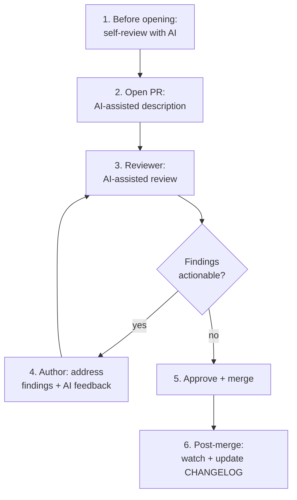

# Pull request workflow with AI

How to use an AI assistant across the lifecycle of a pull request — from
opening it to landing it — without the AI becoming the bottleneck or
the rubber stamp.

## When to apply

Every PR you open or review. Adjust depth based on PR size and risk: a
3-line typo fix skips most steps; a 600-line cross-cutting refactor uses
all of them.

## Required tools

- Your IDE's AI assistant for authoring.
- `prompts/code-review/pr-review.md` (and friends) for review.
- The repo's CI (typecheck, lint, tests) running on PR.
- Optional: GitHub MCP if you want the AI to read related issues/PRs.

## The flow

## Step 1 — Before opening: self-review with AI

Before you open a PR, run a self-review against the diff:

> "This is the diff I'm about to PR. Apply
> `prompts/code-review/pr-review.md` to it. Be harsh."

Common findings you will catch yourself this way:
- Commented-out code you forgot to delete.
- Console logs, debug statements, `it.only` in tests.
- TODOs you added in the heat of work.
- API changes you forgot to document.
- A test you added that doesn't actually assert anything.

Fix everything you would be embarrassed to have a reviewer catch.

## Step 2 — Open the PR with an AI-assisted description

A good PR description has three sections:

- **What** — the change, one paragraph.
- **Why** — the reason; link to the issue/spec.
- **Test plan** — what you did to verify, and what reviewers should
  click/run to verify.

Prompt:

> "Generate a PR description from this diff. Three sections: What, Why,
> Test plan. Cite specific files and behaviours. No marketing language.
> The Why must reference the issue/spec/Slack-thread that motivated this
> work — if I haven't given you one, ask."

Edit the output. PR descriptions are read by future-you debugging a
regression — make them dense and specific.

## Step 3 — Reviewer: AI-assisted review

If you are reviewing someone else's PR:

1. **Read the PR description first.** If it is unclear, ask for
   clarification before reading the code. Code without context is
   noise.
2. **Run the appropriate review prompt** against the diff:
   - General PR: `prompts/code-review/pr-review.md`.
   - Auth / input handling / crypto: also
     `prompts/code-review/security-audit.md`.
   - Hot paths / data access: also
     `prompts/code-review/performance-review.md`.
3. **Treat AI output as a draft, not a verdict.** The AI may flag
   non-issues (false positives) and miss real ones (false negatives).
   Use it as a structured first pass.
4. **Leave review comments in your own words.** A wall of AI-generated
   comments degrades trust; a few sharp, specific comments builds it.

What the AI is good at:
- Catching obvious correctness bugs and security issues.
- Forcing comprehensive coverage (sections you'd otherwise skip).
- Spotting redundant or dead code.

What the AI is bad at:
- Architectural judgement that requires multi-week project context.
- Knowing your team's unwritten conventions.
- Distinguishing "fine for v1" from "needs to be perfect" — that's
  product judgement, your job.

## Step 4 — Author: address findings

For each reviewer comment:

- **Agree** → fix and reply with the commit reference.
- **Disagree** → explain why, propose alternative, ask for buy-in.
- **Out of scope** → file a follow-up issue, link it, and explain.

If the reviewer left AI-flavoured feedback that you suspect is a false
positive:

> "Here is the comment and the relevant code. Is the concern correct?
> If not, explain why precisely so I can reply."

Do not dismiss feedback without engaging with it, even if you suspect
the reviewer generated it lazily — the reviewer is still accountable
for whatever they posted.

## Step 5 — Approve + merge

Before merging:
- [ ] CI green (typecheck, lint, tests).
- [ ] All conversations resolved.
- [ ] PR description updated if scope shifted during review.

Merge strategy: follow the repo's convention. If undefined, prefer
**squash merge** for feature branches with messy commits and **merge
commit** for branches where history is curated.

## Step 6 — Post-merge

Two small steps that pay back later:

- **Watch the deploy.** Most regressions surface within minutes.
- **Update the CHANGELOG** if your project keeps one (use
  `prompts/docs/changelog-from-commits.md` at release time, not per PR
  — unless your team's process is per-PR).

## Anti-patterns to avoid

- **AI as rubber stamp.** Approving a PR because the AI review said
  "no blockers" without reading the diff yourself. You are still
  accountable.
- **Wall-of-comments review.** Posting every AI finding verbatim
  intimidates the author and dilutes the high-signal comments.
- **PR-description theatre.** Long, padded descriptions written to
  *look* thorough without conveying information. Be terse.
- **Reopening conversations as "fixed".** Reply with the actual commit
  or file:line, not just "done".
- **Skipping self-review on small PRs.** A 5-line PR can still leave a
  `console.log` in production. Always self-review.
