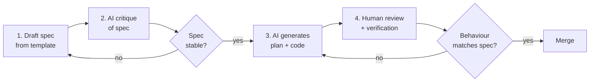

# Spec-Driven Development with AI

A four-stage loop for building a feature where the spec is the source of
truth and the AI generates code from the spec, not from a verbal request.
The point is to make the *spec* the artefact you iterate on, not the code.

## When to apply

- Features larger than a single function (≥ ~3 files affected).
- Cross-cutting work where alignment with stakeholders matters.
- Anything that will outlive the original author.

Do **not** use this for: typo fixes, one-line bug fixes, exploratory
spikes (where the goal is to learn, not to ship).

## Required tools

- **`agent.md`** in the repo, configured with the project's tech stack.
- **`templates/feature-spec.md.template`** as the spec scaffold.
- An AI assistant with file edit and shell exec capabilities (Cursor,
  Claude Code, Cline, Aider, etc.).
- Recommended MCPs: filesystem (for context), sequential-thinking (for
  the planning step), github (if the spec links to issues/PRs).

## The loop

## Stage 1 — Draft the spec

Copy `templates/feature-spec.md.template` to `docs/specs/<feature>.md`.
Fill in:

- **Problem:** what is wrong today, in user terms.
- **Goal:** what changes for the user when this ships. Single sentence.
- **Non-goals:** what is explicitly out of scope. This is the most
  important section — it bounds AI scope creep.
- **User-facing surface:** new UI elements, API endpoints, CLI flags,
  config options.
- **Acceptance criteria:** observable behaviours the feature must
  exhibit. Write these as testable statements.
- **Open questions:** anything you don't know yet. Do not invent
  answers.

Do not write code yet. Do not write design details unless they constrain
implementation.

**Expected output of this stage:** a `<feature>.md` spec, ~200-400 words.

## Stage 2 — Have the AI critique the spec

Open the spec file in your IDE and prompt:

> "Critique the spec in this file. Look for: ambiguous acceptance criteria,
> hidden assumptions, missing edge cases, scope creep in 'goal' that
> contradicts 'non-goals', unanswered open questions that block
> implementation. Do not propose code yet."

Iterate: fix the spec, re-critique. Stop when the AI's critique returns
"no significant gaps" or only nits.

**Expected output of this stage:** a stable spec the AI cannot poke
meaningful holes in.

## Stage 3 — Generate plan + code

Prompt:

> "Implement the feature spec in `docs/specs/<feature>.md`. First, output
> a plan: files to create/modify, in dependency order. Wait for my
> approval before writing code."

Review the plan critically. The plan is the cheapest place to catch
mistakes. Once approved:

> "Proceed with the plan. Stop after each file for me to skim the diff."

For small features, you can collapse "stop after each file" into "stop
after each logical step" (e.g. data layer → API → UI).

**Expected output of this stage:** code that implements the spec, in
diffs you have reviewed at each step.

## Stage 4 — Human review + verification

Run, in this order:

1. **Typecheck / lint.** Fix any errors before continuing.
2. **Unit tests.** Generate if missing, using `prompts/tests/unit-tests-from-fn.md`.
3. **E2E** for user-facing acceptance criteria, using
   `prompts/tests/e2e-scenarios.md`. One scenario per acceptance criterion.
4. **Manual verification.** Go down the acceptance criteria list and
   try each one in the running app.

If any acceptance criterion fails, return to Stage 3 with the specific
gap stated. Do **not** patch over a failing criterion without updating
the spec — if the spec was wrong, fix the spec first, then regenerate.

## Anti-patterns to avoid

- **Skipping the critique step.** It feels slow; it is faster than
  reverting half a day of generated code.
- **Treating the AI's plan as final.** The plan exists so you can edit
  it cheaply. Edit it.
- **"Generate all the files at once" mode.** You will not review them
  carefully. Generate in batches.
- **Letting the spec drift during implementation.** If implementation
  reality forces a spec change, change the spec first as a separate
  commit. Otherwise you cannot tell why the code looks the way it does
  six months later.

## When this workflow is overkill

If the change takes ≤ 30 minutes and affects ≤ 1 file, skip to
`workflows/feature-development.md` (a lighter version) or just write
the code. Process has a cost; pay it only when the change is big enough
to amortise it.
